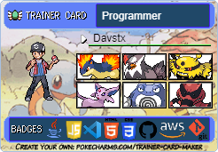

<h1 align="center">Hi 👋, I'm Davstx</h1>
 

- 🎓 I'm currently studying Computer Science at the University.

- 🤝 I’m available for freelancing or job offers.

- 🌱 I'm learning more about Java, Graphic Design, and Cloud Architecture.

- 📝 My goal is to work with games at some point.

- ✏️ I like drawing as a hobby.

- 📫 How to reach me **davidsilvateixeira5@hotmail.com**

### 🤝🏻 &nbsp;Connect with Me

### 🛠 &nbsp;Tech Stack

&nbsp;
&nbsp;
&nbsp;
&nbsp;
&nbsp;
&nbsp;
&nbsp;
&nbsp;

&nbsp;

### ⚙️ &nbsp;GitHub Analytics

